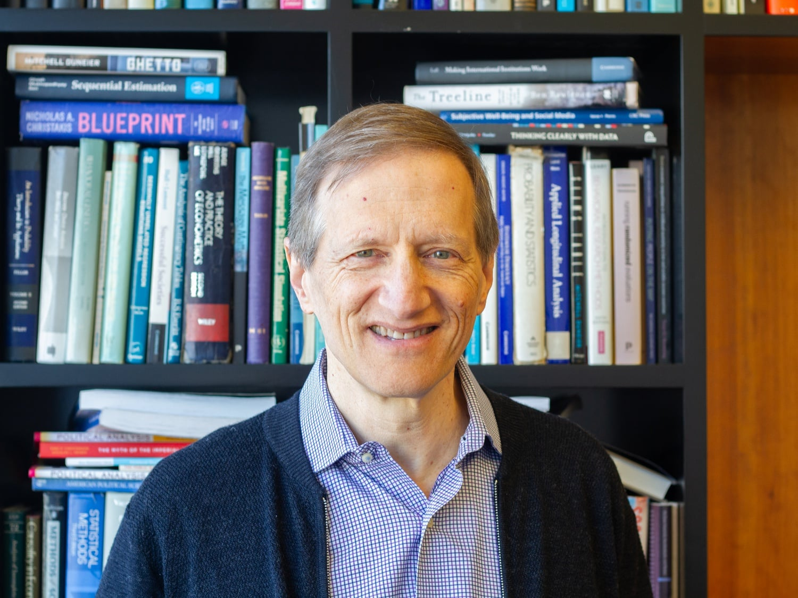

By Neil H. Shah, <em>The Harvard Crimson</em>, March 9, 2024. <a href="https://www.thecrimson.com/article/2024/3/9/gary-king-profile/" target="_blank" rel="noopener">Originally published at thecrimson.com</a>.

<figure style="margin:1.5rem 0;">
  
  <figcaption style="font-size:0.85rem;color:#666;margin-top:0.5rem;">Gary King, Albert J. Weatherhead III University Professor and Director of the Institute for Quantitative Social Science, blends entrepreneurship and academia in pushing the boundaries of social science. Photo by Ike J. Park.</figcaption>
</figure>

---

Gary King might have a clone — or, at least, that's what I thought while skimming his Wikipedia page in advance of our interview.

On the one hand, there's Harvard University professor King — a social scientist who holds Harvard's highest faculty rank, has written nine books and more than 170 articles, and has advised several prominent scholars (including former University President Claudine Gay, though he declined to comment on Harvard's recent woes).

And on the other, there's serial entrepreneur Gary King, the founder of six companies — four of which have been acquired, including by giants like educational company Pearson, and one of which has more than one million users.

But King argues that his frequent traversal of the boundaries between academia and industry is "not a double life." Rather, to King, they're just different facets of the same job — and, if anything, that back-and-forth "helps both."

Those industry connections, King explains, have helped make his scholarly work "much, much, much better" because they give him access to more data.

Here's the typical cycle: First, King's scholarly work inspires him to found a company or create a product. That company, by bringing those ideas to scale, gives him access to more data. Then, King takes that data and writes a new paper, and it all repeats — something King says "has happened dozens of times."

He gives the example of Crimson Hexagon — a company founded to monetize the methodology that King and a team of researchers used to analyze trends in social media users' views of Hillary Clinton and former U.S. President Barack Obama during the 2008 Democratic presidential primary.

"We developed this method, it worked great, we wrote academic articles on it, and then it turned out that that could be commercialized and used for others," King says.

A few years later, when King wanted to expand the methodology to work with Chinese texts, obtaining Chinese social media data was simple. He went to Crimson Hexagon and downloaded its archive of scraped Chinese social media posts.

In 2013, King and his colleagues published an analysis of social media censorship by the Chinese Communist Party, a widely-cited and foundational paper in understanding Chinese social media censorship.

"It's so cool — the thing that we found," King explains. "What everybody thought was you criticize the government and you get in trouble — they censor your posts. Not true!"

"But, if you say 'And let's go protest,' that will be censored. In fact, if you say 'The leaders of this town are doing such a great job, let's have a rally in their favor,' they will censor you," King adds.

King says academia-industry collaborations like that are essential for the social sciences.

"It used to be that most of the data in the world was created here — at the University," King says. "Now, the vast majority of data in the world about the people that we study are tied up inside private industry."

That craftiness, of finding unique data sources and insights, is something King feels contributed to his meteoric rise in the social sciences. Even when he consulted as an expert witness in gerrymandering cases, he says, being able to later use the data for research was often his "price of admission" — a prerequisite for his expertise.

I'm skeptical of how King's work might blur the boundary between data he's making money off of and data he's studying, but he explains that there's a clear separation. He says that once one obtains user data outside of academia, there's a review process from an institutional review board that verifies that data on human subjects is acquired ethically.

And, per King, he's always had that entrepreneurial spirit — his eyes light up as he recalls his past as a magician, quipping that he "had a business doing that as well."

"That's how I paid for college," King says.

He even gave me a startup idea on my way out the door — though I won't share it with you all in the hopes of being rich one day.

Not all of King's companies are concretely tied to monetizing his research or a need for data that only industry could acquire, though. Some of them, he says, served to solve problems that he experienced himself as a teacher.

In 2015, for example, he founded Perusall — which makes software for increasing engagement in classes. For instance, a professor could upload a reading and have the class annotate it together on Perusall. The idea, he explains, stemmed from his own desire that students would do more of the readings he assigned in his classes.

And it just happened to be successful: "I built it for my own class. It just happens that a million and a half other people also use it," King says.

---

— Magazine writer Neil H. Shah can be reached at neil.shah@thecrimson.com.

